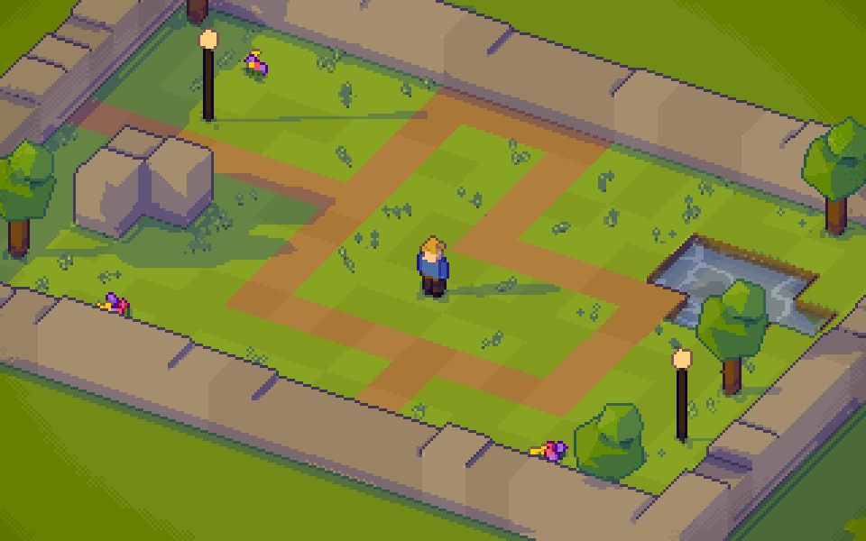

# pixel3d-renderer

A WebGL (three.js) renderer that draws 3D scenes as proper pixel art: a low-resolution G-buffer, palette-controlled hue-shifted ramps,
selective outlines, gradient-aware dithering, time of day and a living, animated world. It started as an experiment inside the Farm
Frenzy / Harvest Frenzy repo, moved here on 2026-10-01, and is now a library that games install from a release tag. The first game on it is
[Soil n Silo](https://github.com/CelestialLemon/Soil-n-Silo).
Next steps are in [`docs/ROADMAP.md`](docs/ROADMAP.md).

```sh
npm install
npm run browser:install   # the pinned Chromium the check tools use, into .browsers/ (git-ignored)
npm run dev          # http://127.0.0.1:5180 (pinned: the tools use this address)
npm run typecheck
npm test             # builds the package (lib/) and runs the unit tests against it
npm run build        # the demo pages, into dist/ (`npm run build:baked` bakes the scenes first, for a fast start)
npm run example      # the example game, http://127.0.0.1:5181
npm run check        # typecheck + golden images + browser checks (needs the dev server running)
```

## Using it in a game

The renderer is a library: the game owns its loop, state, input and UI, and each frame tells the renderer where everything is
and asks it to draw. [`examples/walker/`](examples/walker/) is a complete small game written against the package the way a
separate repo would use it (walk with the keyboard, click to place things); start there.



Install it from a version tag, with three.js beside it (a peer dependency, so the game and the renderer share one copy; each
release supports one three.js minor version, 0.180 for now). Installing from git needs Node 22.18 or later, which builds the package:

```sh
npm install three@0.180 github:CelestialLemon/pixel3d-renderer#v0.1.0
npm install -D @types/three@0.180     # for TypeScript
```

npm builds the package (`lib/`, the `prepare` script) when it installs it from git. Recent npm versions warn that the
package's install scripts aren't approved yet; if yours refuses to run them, approve it with `npm install-scripts approve pixel3d-renderer`. While a game and the renderer change together, point the game at
a local checkout instead (`npm install ../pixel3d-renderer`, then `npm run build:lib` in the renderer after each change).

```ts
import * as THREE from 'three';
import { GeometryCollector, PixelRenderer, quantizePalette, lookAt } from 'pixel3d-renderer';

// Build the world once: collect geometry, reduce the colours (objects too), then hand it to a renderer.
const world = new GeometryCollector(), crate = new GeometryCollector();
// ... world.add(geometry, matrix, colour, flag) for every static part; crate.add(...) in local space
// Only the static geometry and the sun-shadow area are required; lamps, fluids and ambient motion are optional.
const scene = { staticGeometry: world.build(), shadow: { center: new THREE.Vector3(), radius: 12 } };
const crateGeometry = crate.build();
quantizePalette([scene.staticGeometry, crateGeometry], 64);
const r = new PixelRenderer(canvas, scene, { shadowMapSize: 2048 });
r.resize(320, 180);                               // art pixels; scale the canvas up with CSS
const box = r.addObject(crateGeometry);           // things the game moves

function frame(t: number) {
  box.setTransform(new THREE.Vector3(Math.sin(t), 0, 0));
  r.setLook(lookAt(17.5));                         // only when the time of day changes: a new sun redraws its shadow map
  r.placeCamera(target, azimuth, elevation, 11);  // radians; 11 m of world from top to bottom
  r.renderGeometry(t);
  r.renderStyle(t);                               // or renderStyle(settings, t) to turn effects off
}
canvas.onpointerdown = (e) => console.log(r.pick(e.clientX, e.clientY));   // what is under the pointer
```

The public API is everything [`src/renderer/index.ts`](src/renderer/index.ts) exports. A game can bring its own day cycle
(`dayCycle`), shader limits and shadow map sizes (`PixelRendererOptions`), and can bake a built scene to a binary file
(`encodeScene` / `decodeScene`) to skip building it at load.

**Releases.** The version in `package.json` names the release, and a git tag `v<version>` (e.g. `v0.1.0`) marks it. To release:
merge to `main`, bump `version`, commit, then `git tag v0.2.0 && git push origin v0.2.0`. Games pin a tag and upgrade when they
choose; a change that breaks the API gets a new minor version while the major version is 0.

## Pages

| URL | What it is |
| --- | --- |
| `/` | **Comparison page.** Every pass draws the same Cookie Co. view with one shared camera, sun, art-pixel size and clock. Side by side (default) or a wipe with draggable boundaries. |
| `/pass3.html` | **The current renderer on its own**, full window, with time-of-day controls and an optional wipe against Pass 1. `?scene=<id>` picks a scene. |
| `/pass0.html` | Pass 0's original standalone page (kept for the pixel-preservation check). |

Controls: drag to orbit, wheel to zoom, shift/right-drag to pan, A/D or arrows turn 45°, H hides the controls. Save PNG exports at
native art resolution (comparisons are labelled).

## Layout

```
src/
  renderer/            the reusable core (import from src/renderer/index.ts only)
    renderer.ts        PixelRenderer: G-buffer, shadow mask, post shader, clean-up
    shaders/           GLSL: gbuffer.ts (static + animated vertex shaders), post.ts (the pixel-art stylisation), cleanup.ts
    scene.ts           PixelScene: what a scene hands the renderer (geometry, lamps, ripples, grooves, shadow area)
    flags.ts           surface flags (NORMAL, EMISSIVE, DECOR, STEAM, WATER, GLOW, GROOVED)
    motion.ts          vertex animation modes for moving geometry (sway, conveyor, smoke, butterfly, firefly)
    geometry.ts        GeometryCollector and helpers for building scene geometry
    palette.ts         OKLab palette reduction (minimax merging)
    gltf.ts            glTF loading and per-mesh rules (flags, motion, skip)
    look.ts            time of day: sun, colour grade, sky, lamps
  scenes/              scene content: one folder per scene, registered in scenes/index.ts
    cookie-co/         the factory, meadow, trees, pond and wildlife
    village/           Lantern Row, a night village street: layout, paving, walls, canal, trees, and placement of the modelled buildings
    test-chart/        calibration bays (thin features, curves, ink, AO, palette, lamps)
    props/             gallery of every modelled prop in assets/props/
    shared/            seeded randomness and noise for building scenes
  app/                 the demo pages: compare/ (index.html), viewer/ (pass3.html), shared orbit camera, params, pass registry
  reference/           FROZEN: Pass 0 and Pass 1 pipelines and their world. Never edit (golden images prove they are unchanged).
archive/pass2-atmosphere/   Pass 2, archived (not built)
assets/cookie-factory/      Blender source, build script and export_glb.py for public/cookie_factory_current.glb
assets/props/, assets/village/   Blender build scripts for the batch 1 props and the Lantern Row models (GLBs in public/props/, public/village/)
tools/                      headless-Chrome capture and check scripts
docs/ROADMAP.md
```

## How the renderer works

Each frame, `PixelRenderer` (`src/renderer/renderer.ts`):

1. **Rasterises a G-buffer** at art resolution (one canvas pixel per art pixel; CSS scales it up with nearest-neighbour). Two targets:
   albedo + surface flag, and world normal + linear view depth. The static world is one merged mesh. A second, dynamic mesh holds
   everything that moves and is animated in its vertex shader. Transparency is ordered-dither discard.
2. **Renders a shadow mask** from the sun's shadow map (static world only; moving bits take the shadow of the surface behind them).
3. **Stylises** in one post shader: silhouette ink drawn on the far pixel, a banded sky, water, hue-shifted OKLab ramps, gradient-aware
   dithering (only where the light really forms a smooth gradient), cloud shadows, contact occlusion, convex/concave creases, lamp pools,
   groove lines and corner shading. Each surface flag changes which of these apply.
4. **Cleans up** orphan pixels on flat surfaces.

The geometry carries one flat colour per vertex. Scenes reduce all colours to a small palette (`quantizePalette`: minimax merging in
OKLab, 80 colours by default), so the image uses a controlled set of base colours that the ramps then shade. Minimax keeps the worst shift
of any input colour small, so a colour on a small object is not absorbed into a clearly different one.

### Scenes

A scene module builds a `PixelScene` (`src/renderer/scene.ts`) and registers a `SceneDefinition` (`src/scenes/types.ts`) with its camera
framing. Nothing scene-specific lives in the renderer: lamps, water ripple points, groove lines, the shadow area and every animation anchor
are scene data. To add one:

1. Create `src/scenes/<id>/index.ts`. Use two `GeometryCollector`s (static, and dynamic for moving parts), fill them with
   `collectGltf` and/or procedural geometry, give moving parts a `motion.*` and surfaces a `FLAG`, then `build()` them and run
   `quantizePalette`.
2. Use one seeded `mulberry32` generator per build (and consume it in a fixed order), so the scene and its palette are reproducible.
3. Add it to `SCENES` in `src/scenes/index.ts`. `/pass3.html?scene=<id>` shows it, and a scene picker appears once there are two.

Shader limits per scene: 32 lamps, 4 ripple points, 8 groove positions (`LIMITS` in `scene.ts`). A scene can set `hour`, the time of day
the viewer starts at (Lantern Row starts at night).

### Passes

The comparison page shows every entry of `PASSES` in `src/app/passes.ts`, wrapped in one `PassView` interface. To try a new renderer
iteration side by side with the current one, add an entry there. The pages, layouts, wipe dividers and exports adapt to the count.

- **Pass 0 — Original** and **Pass 1 — Refined** (correct shadows, float depth, restrained ramps, contact occlusion, selective edges):
  frozen references in `src/reference/`.
- **Pass 2 — Atmosphere:** archived. Its depth haze washed the scene out. See `archive/pass2-atmosphere/`.
- **Pass 3 — Golden Hour:** the current renderer, `src/renderer/` + `src/scenes/cookie-co/`. It adds a living world (swaying grass,
  flowers and reeds; chimney smoke; belt cookies; butterflies; fireflies at night; a rippling pond), time of day (keyframed sun path,
  warm/cool band tints, exposure, sky, lamps; presets Morning, Noon, Golden hour, Dusk, Night), lamp light that multiplies the surface
  colour after dusk, a moonlit night grade, warm light pools below lit windows, scalloped leaf-clump foliage, and quieter finishing (cloud shadows darken by one band, two hard corner rings, no depth haze).

Passes 0–1 draw their own static world without the pond, leaf-clump trees and motion, so the comparison mixes renderer and content changes.

## Checks and tools

All tools drive a headless browser (`tools/lib.ts`) and need the dev server. They use the pinned Chromium from
`npm run browser:install`; on macOS without it they fall back to the installed Google Chrome. `CHROME_PATH` and `DEMO_URL` override
the browser and the server.

The tools are TypeScript that Node runs as is, by stripping the types (Node 22.18 or later), so there is no build step.
`npm run typecheck` checks them with `tools/tsconfig.json`; the code they run in the page gets the app's own types. Node
only strips types, so the tools can't use enums, namespaces, constructor parameter properties or `<T>value` casts (write
`value as T`).

`GL_BACKEND` picks how the browser renders WebGL:
- `swiftshader`: on the CPU. It's the default on macOS, where headless Chrome has no GPU.
- `vulkan`: on the real GPU. It's the default on Linux, and much faster: the golden run takes 1 minute instead of 9 on a Ryzen 5 1600 with a Radeon RX 570.
- `gl`: also on the GPU, through OpenGL. Linux only.

A tool fails rather than quietly fall back to the CPU when a GPU backend is chosen but not available.

| Command | Checks |
| --- | --- |
| `npm run golden` | **Golden images** (`tools/golden.ts`): 42 fixed views with a frozen clock, compared pixel for pixel with the approved images (tracked, so a PR shows reviewers every view it changes). The output is only identical on the same platform, CPU architecture, backend, GPU and browser, so each combination has its own set, `golden/<set>/`; the run prints which one it uses, with the browser version. Sets made with the pinned Chromium have no browser suffix (e.g. `linux-x64-vulkan-amd-radeon-rx-570`); any other browser adds `-chrome`. `darwin-arm64-swiftshader-chrome` came from an M4 MacBook Air's installed Google Chrome, version not recorded; running `npm run browser:install` on that Mac switches it to a new set, `darwin-arm64-swiftshader`. Any difference fails and writes the new image to `golden/diff/<set>/` (git-ignored). A new machine creates its set with `golden:update` from a known-good commit. A Chrome or graphics driver update can also change the output: if many shots fail after one, check the diffs and regenerate the set from a known-good commit. A deliberate visual change updates every set the team uses, so the PR shows each changed view on each set. Run it before and after every change: a refactor must stay identical, and a deliberate change shows exactly which views it touched. After an intended change, accept it with `npm run golden:update` on the work's branch, never directly on `main`: new baselines reach `main` only through a PR, where the reviewer sees each changed view. `node tools/golden.ts pass3` runs a subset. |
| `npm run lamp-shadow-check` | Lamp shadow atlas: enclosed shells, back-facing panels, fixture clearance, and fitting small device limits (2048 and 512 px) with smaller faces. |
| `npm run moving-shadow-check` | Sun-shadow mask on rigid moving parts (`move_spin_`/`move_sway_`): a moving panel at rest, spun 90 degrees and mid-swing gets exactly the mask of the same panel as static geometry at that pose, over striped ground (no borrowing the background) and under a roof (no "always sunlit"), without painting over static geometry in front of it. |
| `npm run village-check` | Lantern Row: canopies clear every building, backdrop house, street, quay and the water, and buildings don't overlap or stand in the water (`layoutProblems` in `layout.ts`); models tied to layout features follow them; the mill wheel turns across the canal's flow in the main channel; moving parts spin about their node's local X axis; villager splitting keeps nested meshes single and parent prefixes; a missing or corrupt model fails the build visibly. |
| `npm run camera-check` | Camera snap: the image shift the renderer reports for the camera it snapped to the art-pixel grid (`snapShift`) moves projected landmarks back onto the requested camera, for both signs, with and without a capture margin, at several scales, and repeatably. |
| `npm run settings-check` | Game-supplied settings: custom and reduced limits compile and draw, invalid scene/capacity inputs are rejected before WebGL allocation and excessive uniform budgets after querying the GPU, shadow map sizes, resolve options, custom day cycles and minimal scene inputs. |
| `npm run startup-check` | Exact binary/gzip roundtrips for all six scenes, including prepared fluid/window maps and local object geometry; live and decoded first frames must match pixel for pixel. |
| `GL_BACKEND=swiftshader npm run golden -- --ci` | Ten fixed comparison, day/night, water and object views against `golden/ci-linux-x64-swiftshader/`. CI installs the pinned browser and uses this CPU-rendered set. Its references come from known-good main; existing GPU references stay unchanged. |
| `npm run bake` / `npm run build:baked` | Generate compressed default scenes in `public/baked/`, then build the optimized production app. The baker starts and closes its own server. Dev always builds live; a regular build without a bake does too. A present but stale bake fails with a regeneration message. |
| `node tools/startup-bench.ts [--baked]` | Three sequential runs per Cookie Co./village scene, reporting median asset load, renderer setup and first-frame time. `--baked` includes fetching and decompressing the generated asset. Reports go to `out/startup-bench/`. |
| `npm run pick-check` | Picking (`PixelRenderer.pick`): the art pixel, world position and object under a point at supersample 1 and 3, for the sky, the baked and animated world and objects (instanced, mirrored, hidden, removed, through batch growth), plus the resolve keeping the id of the sample it draws. |
| `npm test` | Unit tests (`test/`, Node's test runner) for the palette, geometry, day cycle and limits, run against the built package (`lib/`), imported by its name like a game does. No browser. |
| `npm run example-check` | The example game (`examples/walker/`) against the built package: it starts, walks, stops at walls, and places and removes things by clicking. Serves the example itself; screenshots in `out/example/`. |
| `node tools/verify.ts` | Comparison page: Pass 0 matches its standalone page; modes; ordered wipe dividers; shared camera, sun and resolution; layouts; PNG export sizes; mobile; time of day; animation toggle; no browser or shader errors. |
| `node tools/check-viewer.ts` | The viewer page's controls, compare wipe and mobile layout. |
| `node tools/anim-check.ts` | The world moves between two clock times and renders identically at the same time. |
| `node tools/door-strip.ts [px] [name]` | Sub-pixel flicker contact sheet: the door at 8 tiny camera steps (`out/<name>.png`). |
| `node tools/shot.ts <name> "<query>" [WxH]` | Screenshot of `/pass3.html` (`PAGE=index.html` for the comparison page) plus the art resolution and colour count. |
| `node tools/palette-check.ts` | Palette quality per scene: worst shift of any input colour, and each merged group whose worst shift or widest input pair is at least `REPORT_THRESHOLD` (default 0.05) (`K`, `MAX_ERROR`). Fails over `MAX_ERROR` (default 0.10). |
| `node tools/comparison-sheet.ts` | The passes side by side at 2x (`out/passes.png`), from the captures `verify.ts` writes. |

`out/` holds scratch captures and is git-ignored; it is safe to empty. The approved golden images are tracked in `golden/`.

## Videos

`tools/timelapse.ts` renders a scene into an MP4 (or a still PNG) in `out/timelapse/`, with ffmpeg (`/opt/homebrew/bin/ffmpeg`,
or set `FFMPEG_PATH`; `tools/video-check.ts` also takes `FFPROBE_PATH`, by default the ffprobe next to ffmpeg). It needs a dev server.

```sh
node tools/timelapse.ts day-to-night                       # a ready-made clip (see below)
node tools/timelapse.ts square-orbit --res 4k --fps 60 --workers 3
node tools/timelapse.ts --view mill --hour 8..22 --seconds 12   # ad hoc: fixed camera, hour swept 8:00 -> 22:00
node tools/timelapse.ts --still --view overview --hour 21  # one PNG
node tools/timelapse.ts my-clip.json --keep-frames         # your own clip file; also keep the PNG frames
```

- **Deterministic.** Frame `i` is drawn at clock time `time + i / fps` and read straight off the canvas, so nothing is recorded in
  real time: no frame is dropped or repeated, and the same command gives the same video. The water, smoke, fireflies, mill wheel and
  windmill run on that clock. `--workers N` renders with N headless browsers at once, with identical frames.
- **Pixel-art friendly.** The scene is drawn at the art resolution (one canvas pixel per art pixel) and scaled up by a whole number
  with nearest-neighbour scaling. `--res 1080p` (default) or `4k` with `--scale` 4 or 8 respectively, i.e. 480x270 art; e.g.
  `--res 4k --scale 6` is 640x360 art, so more detail. `--res WxH` takes any size that is a multiple of `--scale`. `--fps` is 30 by default.
- **Smooth camera moves.** The renderer snaps the camera to the art-pixel grid so the art doesn't crawl, which on its own leaves a
  moving camera off by up to half an art pixel (2 px at 1080p), so the picture can jump by nearly a whole art pixel between frames. A
  video draws 4 art pixels of margin all round, then moves each upscaled frame by the snap the renderer threw away, in steps of 2
  output pixels (an odd step would smear 4:2:0 colour across art-pixel edges, which an even `--scale` otherwise keeps aligned). Steps
  of 2 pixels need `--scale` 3 or more to do anything; the default 4 and 8 move in steps of half and a quarter of an art pixel. The
  art stays on its grid, and the picture is within 1 output pixel of the requested camera. Screen-anchored effects (the ordered
  dither, vignette and sky bands) are drawn per art pixel, so they move with the picture. The vignette and sky sit a few pixels
  further out than on a still, because the canvas is bigger. Only the `hook` driver reports the snap; the others draw the margin and
  crop it centred. `--no-subpixel` turns it off, and `--still` never uses it. The sub-pixel motion also makes the video harder to
  compress: about twice the size at the same `--crf`.
- **Clips.** The presets live in `tools/timelapse-presets.ts`: `day-to-night` (the overview from 8:00 to 22:00), `square-orbit` (a
  slow turn round the market square) and `canal-fly` (along the canal, under the bridges). A clip file has the same shape:

  ```json
  { "scene": "village", "seconds": 16, "linear": ["hour"],
    "keys": [{ "at": 0, "view": "street", "hour": 9 }, { "at": 8, "az": 75, "zoom": 16 }, { "at": 16, "view": "canal", "hour": 20 }] }
  ```

  A key can start from a scene view preset (`view`) and set `az`, `el` (degrees; azimuth isn't wrapped, so 0 to 360 is a full turn),
  `zoom` (visible world height), `tx`, `tz` (the point the camera looks at) and `hour`. A channel a key leaves out isn't pinned
  there. Every channel eases out of the first key and into the last and passes smoothly through the ones between, without
  overshooting. Channels named in `linear` move at a constant rate. Zoom eases in log space. `--scene`, `--view`, `--hour` and
  `--seconds` override a preset, and `--query "a=1&b=2"` adds any page parameter (e.g. `outline=0`).
- **Any dev server, any version.** `--url http://127.0.0.1:5190` (default `$DEMO_URL` or `http://127.0.0.1:5180`) and `--page` point
  it at another server, e.g. one started from an older checkout in a `git worktree`. The tool picks a driver for the page: `hook`
  (`app3.capture`, this version onwards), `legacy` (the `app3` view, `setHour` and `renderGeometry`/`renderStyle` that every version of
  the viewer has had, so camera paths and hour sweeps work too) or `url` (reload the page per frame with the camera, hour and clock
  in the URL, which is slow). `--tier` forces one. Old pages ignore parameters they don't know (no `?scene=` before PR #1, no canal
  town before PR #8), so they show their own default scene; a clip's `view` keys are then skipped with a warning and the camera starts
  from the page's own view. On the requested scene, an unknown view is still an error.
- **Output.** `out/timelapse/<name>.mp4` (H.264, BT.709, `--crf`, default 12), `<name>.camera.json` (the camera, hour and clock of
  every frame, the driver used and, for smooth camera moves, each frame's `snapShift` in art pixels and the `move` in output
  pixels applied for it) and, with `--keep-frames`, the upscaled frames in `<name>-frames/`.
- **Checking a video.** `node tools/video-check.ts out/timelapse/<name>.mp4 --log out/timelapse/<name>.camera.json
  [--reference out/timelapse/<name>-frames/%05d.png] [--static x,y,w,h]` decodes every frame and reports, as JSON, the frame count
  and timing against the log, repeated frames, camera steps and acceleration spikes, pixels that vary inside one art pixel's block
  (smoothing; on the art grid as moved by the log's per-frame `move`), colour error against the kept PNG frames (a moved
  capture needs that run's own frames), and flicker in a still region (art pixels; fixed camera and hour only).
  Structural problems (frame count, timestamps, a log that doesn't match the video) fail; the image measures are warnings to inspect.

## Query parameters

Both pages: `hour` (0–24, default 17.5), `time` (freeze the animation clock, e.g. `time=8`), `anim=0`, `cycle=1` (run the day), `az`, `el`
(degrees), `zoom` (visible world height), `px` (CSS pixels per art pixel), `auto=1` (auto-orbit), `clean-ui=1`, and
`outline|dither|clean|contacts|clouds|glow|vignette=0` to switch effects off.

- Comparison page: `mode=pass0|pass1|pass3` (one pass), `layout=grid|wipe`, `sun` / `sunEl` (override the sun, degrees), `k` (Pass 0–1
  palette size, default 44), `k3` (Pass 3 palette size, default 80).
- Viewer: `scene=<id>`, `compare=1` (wipe against Pass 1), `split` (wipe position, %), `k` (palette size, default 80), `compare=palette`
  (wipe against another palette size: `left-k`, default 56, on the left and `k` on the right).

## Sub-pixel flicker (door planks)

Geometry thinner than a screen pixel flickers as the camera moves, because whether a pixel centre lands on it changes every frame. The door's
five plank grooves are 0.015 units wide (about 40% of a pixel at default zoom), so in Pass 3 they are not meshes: the post shader draws them at
fixed world positions (`DOOR_GROOVES` in `src/scenes/cookie-co/layout.ts`) on the surface flagged `GROOVED`, always exactly one screen pixel
wide. `node tools/door-strip.ts` shows they hold steady. Passes 0–1 still flicker. This is a workaround; proper fixes are on the roadmap.

## Assets

`public/cookie_factory_current.glb` (the Cookie Co. scene) comes from `assets/cookie-factory/cookie_factory.blend` (built by
`build_cookie_factory.py`). Regenerate it with
`blender -b assets/cookie-factory/cookie_factory.blend --python assets/cookie-factory/export_glb.py`. `public/cookie_factory.glb` is
the frozen export that the Pass 0/1 references load; it predates the fix to the door's inside-out winding and is never re-exported.
The model was built for Harvest Frenzy
(`../farm-frenzy` keeps its own 2D sprite versions). three.js turns spaces in node names into underscores, so match names with `[ _]`.
